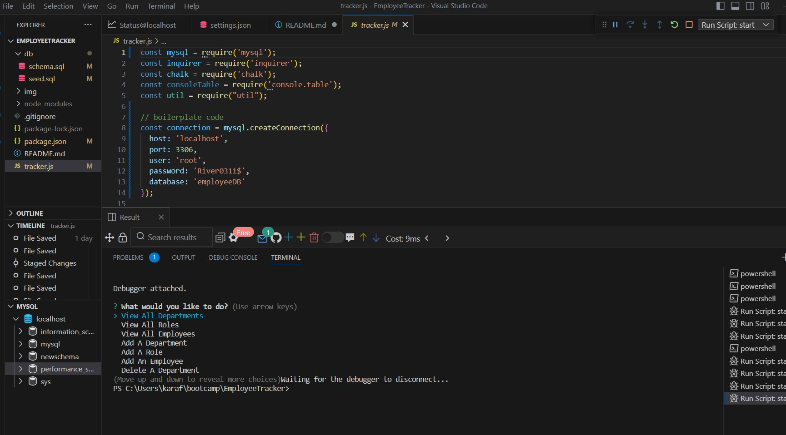

# Employee Tracker
I developed a command-line application using node, inquirer, and MySQL to efficiently manage a company's departments, roles, and employees. My motivation was to provide a centralized solution that simplifies the process of handling various organizational aspects. This application solves the problem of scattered information by allowing users to view, update, and modify department, role, and employee data in one place. Through this project, I gained valuable knowledge and experience while its simplicity and comprehensive functionality make it stand out as a powerful tool for efficient company management.

    


## User Story
```
As a business owner
I want to be able to view and manage the departments, roles, and employees in my company
So that I can organize and plan my business
```


## Functionality
```
WHEN I run the application
THEN I am prompted with a list of options
WHEN I select ‘View All Departments’/‘View All Roles’/‘View All Employees’
THEN I can view a table with all of the current data in the department/role/employee database table
WHEN I select ‘Add A Department’/‘Add A Role’/‘Add An Employee’
THEN I am prompted for the data needed to add a new department/role/employee
THEN based on my input, a new department/role/employee is added to the appropriate database table
WHEN I select ‘Delete A Department’/‘Delete A Role’/‘Delete An Employee’
THEN I am prompted with a list of all current departments/roles/employees
THEN based on my input, a department/role/employee is deleted from the database
WHEN I select ‘Update A Role's Salary’
THEN I am prompted for the role to update and the new salary
THEN based on my input, the role is updated
WHEN I select ‘Update An Employee's Role’/‘Update An Employee's Manager’
THEN I am prompted for the employee to update and the new role/manager
THEN based on my input, the employee is updated
WHEN I select ‘Exit’
THEN the application stops running
```


## Table of Contents 
* [Install](#installation)
* [Usage](#usage)
* [Screenshot](#screenshot)  
* [GitHub URL](#github)
* [YouTube URL](#youtube)
* [Credits](#credits)


## Installation
* Download this repository or fork and clone it to your local device.
* Run an `npm install` to install all of the dependencies:
```
npm install
```
* Update the `tracker.js` file with your `localhost` connection password on line 12:
```
const connection = mysql.createConnection({
  host: 'localhost',
  port: 3306,
  user: 'root',
  password: 'p@ssw0rd',
  database: 'employeeDB'
});
```
* Run the `db/schema.sql` file through MySQL or your command line to create your database and tables:
```
source ~/.bashrc
mysql -u root -p < db/schema.sql
```


## Usage 
* Start the application by typing `node tracker` in your command line:


* Select a choice when prompted and continue to make changes for as long as you'd like:


* When you're done, you can select `Exit` at the end of the main menu choices or `^c` at any time:

## Screenshot


## GitHub URL
https://github.com/karafaris/EmployeeTracker.git

## YouTube URL


## Credits
This CLI App wouldn't run without [Inquirer](https://www.npmjs.com/package/inquirer) or [MySQL](https://www.npmjs.com/package/mysql). [Chalk](https://www.npmjs.com/package/chalk) and [console.table](https://www.npmjs.com/package/console.table) also helped make the content more readable in the console. 
